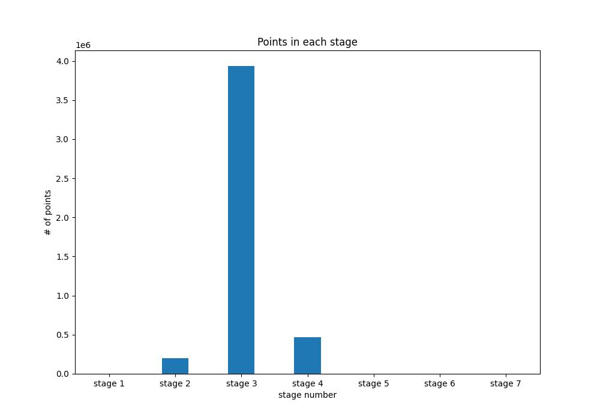
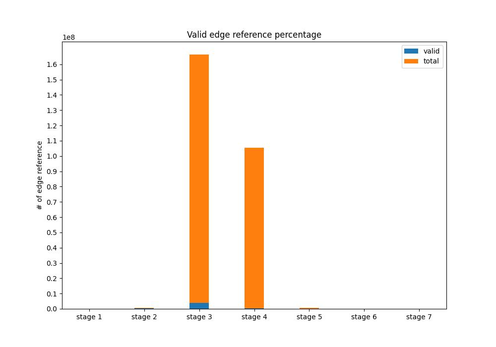
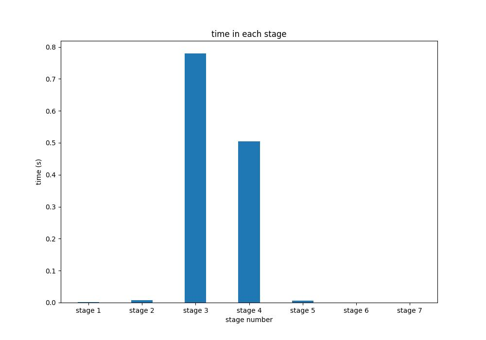
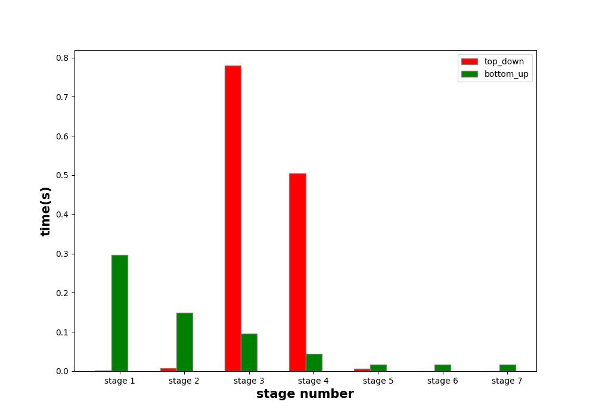
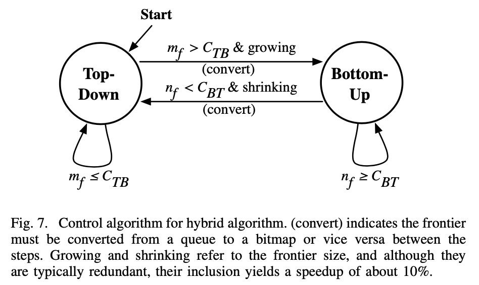
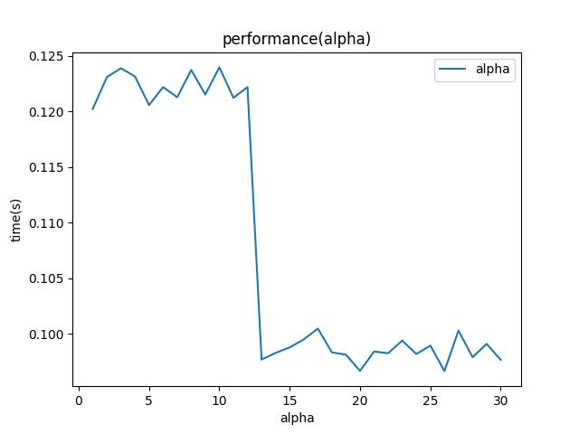
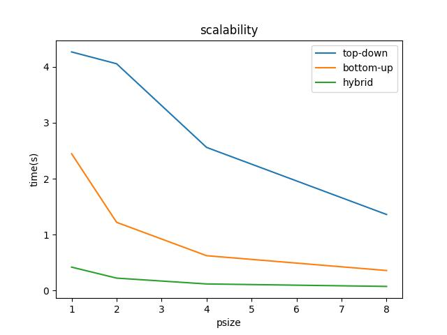
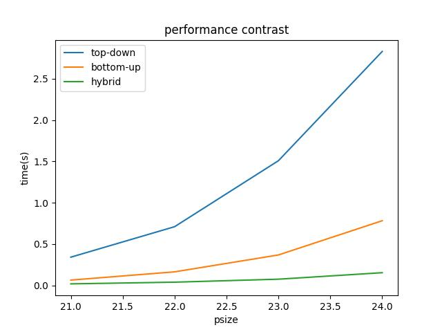

# Report on optimizing BFS

## abstract

本文主要实现了[paper](https://scottbeamer.net/pubs/beamer-sc2012.pdf)中的`bottom-up`算法, 以及`hybrid`算法.

之后的内容主要根据我的分析过程展开, 首先我分析了`graph 500`参考代码中生成图的性质, 并分析传统`top-down`算法的性能瓶颈, 以分析`bottom-up`算法提出的合理性. 并在实现了`bottom-up`算法后, 将其性能与`top-down`算法进行对比, 分析`hybrid`算法的优势.

**warning:** 在测试中我修改了`aml`源码中的`buffer`大小, 将`ARRG`和`AGGR_intra`变量修改为`1<<23`.

## graph property

在阅读完论文之后, 我们不难发现`bottom-up`算法其实是利用输入图的特殊性质优化. 因此我认为在实现自己的`bottom-up`之前有必要观察图的性质, 并且针对传统`top-down`算法进行性能分析, 找出`bottleneck`. 在接下来的分析中, 输入图均选择`p = 23, e = 16`的典型规模, 数据由参考代码产生.


**1.** 每一层点的个数:



<!--  -->

**2.** 传统每一层`top-down`算法每一层需要判断的边数.


<!--  -->

**3.** `top-down`算法每一层耗时统计.



<!--  -->

通过观察图1, 我们确定`graph 500`的图生成算法满足原论文中要求的图性质, 因此实现`bottom-up`算法是合理的.

综合以上三个统计图不难发现, 算法的瓶颈主要在`stage 3 4`, 而这两个`stage`对应的点数是最多的(图 1), 对应的需要检查的边数(图2)也最多. 同时在图2中不难发现在性能瓶颈的阶段, 大部分的边随机访问都是无效的, 意味着极大的性能浪费, 我相信这是启发`bottom-up`算法的一个重要因素.


## bottom-up algorithm

### Two possible implementations

我主要想到了两种实现:

1. 每个`process`仍然只保存`local visit`数组, 每次边访问用`aml`发送边访问并接收对应`visit`信息.
2. 每个`process`均保存`global visit`数组, 每次边访问直接本地内存访问, 但是在过程中需要同步`visit`数组(因为本地修改).

接下来我将从`dependency`和`amount of data`两个角度分析这两种实现.

#### dependency

其实不难发现方法1的实现严重增加了依赖性, 因为每次边检查必须立刻知道该节点是否`visit`, 通过进程间通信将极大增加延迟.

而在方法2中, 边访问的延迟被降低到最小(内存访问), 并且由于我们使用了`bitset`维护, 增加了其缓存的友好性.

#### amount of data

数据量的单位设置为`int`.

方法2的数据量很显然, 即点数除以`32`(`bitset` 压位). 根据**graph property**中的数据, 数据量为`262144`.

而在方法1中, 由于剪枝的存在, 即如果检查到一个`visit`则不用继续访问, 我们这里不考虑剪枝以估计其量级, 在`stage 3`中边检查进行了`162580558`次, 每次传输的`unit`为$2$个`int`, 因此总数据量为`325161116`.

综上所述不难发现在`stage 3/4`这种需要检查大量边的情况下, 方法2相对于方法1传输的数据量减少了至少两个数量级. 而我们实现`bottom-up`的目的即为优化这些`stage`, 因此方法2优于方法1.

**conclusion**: 在`dependency`和`amount of data`两个角度, 方法2均优于方法1, 因此我选择了方法2作为我的实现.

### My bottom-up logic

以下是我的`bottom-up`算法的主体部分, 之后我会描述实现的细节.

```c
for (int i = 0; i < g.nlocalverts; ++i) {
  	if (GET_GLB_VISIT(VERTEX_TO_GLOBAL(rank, i))) continue;
  	for (int j = rowstarts[i]; j < rowstarts[i+1]; j++) { // 有重边...
    		if (GET_GLB_VISIT(COLUMN(j))) { // COLUMN(j)是另一个点.
      			pred_glob[i] = COLUMN(j); // local points' father is j(glb).
      			q2[q2c++] = i; // 加入local访问的点.
      			break;
    		}
  	}
}
for (int i = 0; i < q2c; ++i) SET_GLB_VISIT(VERTEX_TO_GLOBAL(rank, q2[i]));
```

1. 每个`process`维护`global`的`visit`数组.
2. 枚举未访问点, 判断其邻居是否访问, 若访问则加入队列并`break`, 否则继续.
3. 枚举完所有未访问点后, 将队列中的点标记为`visit`.
4. 同步`global`的`visit`数组.

关于维护`global visit`数组, 我的考虑是这样能减少多个`process`之间的依赖, 从而提升性能. 但是这样实现的`trade-off`在于我需要在每轮本地更新`global visit`数组之后做一次全局同步.

`global visit`数组的维护使用了`bitset`压位, 使得传递的数据量可以减少`32`倍, 并可以增加`cache locality`. 这里传递`bitset`数组通信虽然对比只广播新增加的点数据量有稍微冗余, 但是不难发现数组`or`相比数组`random access`同样对缓存友好, 实测若改为广播新增加的点速度会慢`2x`.

### Performance


<!-- 
 -->

上图是`top-down`算法和`bottom-up`算法在每个阶段的性能对比, 不难发现两个算法有互补性(验证了论文中的论断). 即在初始`stage`, 由于点数很少, 同时`bottom-up`算法需要检查大量未访问的点, 因此更适合使用`top-down`算法. 而在中间阶段, 大量的边需要被检查, 因此使用`bottom-up`算法会更优. 在最后几个`stage`, 由于生成图算法的随机性, 整个图所有节点并非两两连通, 因此此时`bottom-up`算法性能由于这些不在一个连通块中的节点产生损耗.

综上所述, 使用论文中的`hybrid algorithm`以综合两个算法的优势达到更好的性能是必要的.

## hybrid algorithm

实现的状态转移参考了论文中的有限状态自动机, 但是我实现了简单版本, 即从`bottom-up`切换到`top-down`永远保持`top-down`状态. 实现的难点主要在于如何统计状态转移需要的信息, 以及选择合适的超参数.


<!--  -->


### State switching

状态转化需要注意的是切换到`bottom-up`的条件需要同步信息, 这样才能保证每个`process`同时切换状态.

```c
// switch_state
if (state == 0) {
    // syn the parameter for unify state.
    int64_t front_edge = 0;
    int64_t last_edge = 0;
    for (int i = 0; i < qc; ++i) front_edge += rowstarts[q1[i] + 1] - rowstarts[q1[i]];
    for (int i = 0; i < g.nlocalverts; ++i) {
      	if (!GET_GLB_VISIT(VERTEX_TO_GLOBAL(rank, i))) 
          	last_edge += rowstarts[i + 1] - rowstarts[i];
    }
    aml_long_allsum(&front_edge);
    aml_long_allsum(&last_edge); 
    state = front_edge * alpha > last_edge? 1: 0;
} else if (state == 1) {
  	state = sum * beta < g.nglobalverts? 2: 1;
}
```

### Parameter tuning

参数选择主要根据我观察到了两个性质:

**P1**: `top-down`到`bottom-up`和反向的转移参数独立.

**P2**: `top-down`到`bottom-up`和反向的转移的参数满足单峰性质, 即可以使用二分法找到最优解.

因此根据以上两条性质, 即可对`alpha`, `beta`分开分析, 并且打印性能函数找到峰值即可.


**alpha-tuning**: 这里只展示`alpha`的性能图, `beta`的调整过程完全相同.


<!--  -->

如图所示我们不难看出`alpha = 13`是一个分界点, 即导致了`top-down`和`bottom-up`算法的切换. 而在大部分情况下由于不发生算法的切换, 因此性能图较为平坦.

最后选择`alpha = 20`, `beta = 100`.

## SIMD Optimization

### global visit synchronization

注意到在做全局同步时, 其实就是做两个向量的`or`, 由于`hw1`的训练我想到了`SIMD`优化.

但是在这里遇到的问题是`intel intrinsic`要求内存是最小单元对齐的, 对于两个数组偏移量不同的情况, 没有很好的办法解决对齐问题, 因此这里我只实现了部分优化. 我认为更加激进的优化需要同时设计低层`MPI`库以支持对其, 由于时间关系没有做.

```c
unsigned long addr1 = vi;
unsigned long addr2 = visited + offset;
if ((addr1 & 0x1Full) == (addr2 & 0x1Full)) {
		for (; addr1 & 0x1Full;) {
				visited[i + offset] |= vi[i];
				++i;
				addr1 = vi + i;
				addr2 = visited + offset + i;
		}
		for (; i + 4 < sz - 1; i += 4) {
				_mm256_storeu_si256(visited + offset + i,
								_mm256_or_si256(_mm256_load_si256(vi + i), _mm256_load_si256(visited + offset + i)));
		}
}
```

### Fine-grained optimization

在`bottom-up`中, 我们有枚举邻居判断是否`visit`的过程, 我认为这里也可以通过向量化实现同时判断多个邻居.

但是由于代码复杂度问题没有进行深入尝试. 

```c
for (int j = rowstarts[i]; j < rowstarts[i+1]; j++) { // 有重边...
			if (GET_GLB_VISIT(COLUMN(j))) { // COLUMN(j)是另一个点.
```


## Experiment

本节主要展示`top-down`, `bottom-up`, 以及`hybrid`算法的性能对比.

所有实验的基础设置均相同, 例如底层`aml`库中`AGGR`, `AGGR_intra`变量.

### Scalability

本节目的体现进程个数的对性能的影响.

由于`graph-500`中的设定, `process = 2^t`时性能会更好, 更具有代表性. 因此测试`scalability`时选取了`process =  1, 2 ,4, 8`.

不难发现`bottom-up`与`hybrid`表现非常好, 为`linear scalability`. 而`top-down`的表现则较差.

| **# of process** | **Top-down** | **Bottom-up** | **Hybrid** |
| ---------------- | ------------ | ------------- | ---------- |
| **1**            | 4.26422      | 2.44518       | 0.41975    |
| **2**            | 4.05262      | 1.22023       | 0.223568   |
| **4**            | 2.5586       | 0.624221      | 0.119508   |
| **8**            | 1.36046      | 0.359567      | 0.0752094  |



<!--  -->

### Pure Performance

使用标准配置即`process = 8`, 衡量的单位为`s`.

| **(p, e)**   | **Top-down** | **Bottom-up** | **Hybrid** |
| ------------ | ------------ | ------------- | ---------- |
| **(21, 16)** | 0.34217      | 0.0651495     | 0.0195314  |
| **(22, 16)** | 0.710704     | 0.164762      | 0.0399537  |
| **(23, 16)** | 1.50816      | 0.36894       | 0.076043   |
| **(24, 16)** | 2.82894      | 0.782756      | 0.154498   |



<!--  -->


## Summary

文中最重要的观察是图的特殊结构, 让`bottom-up`算法可以表现更好, 并结合两种算法分析得到了非常漂亮的`hybrid`算法. 

总体来说我复现了一篇论文, 很有成就感, 并且在复现的过程中验证了论文中提到的性质, 并且能理解算法提出的原因. 

这对我的科研也有很大的启示. 在科研中, 我们会看到很多像这篇论文一样优化具有特殊性质的问题, 而不是要考虑所有的情况. 例如如果我们只考虑所有的情况, 那么显然`Bfs`的时间复杂度最优即为`O(n + m)`, 没有任何优化的空间, 这样就阻挡了我们研究的步伐. 我们需要具有针对特殊设定下的问题具体分析的能力.